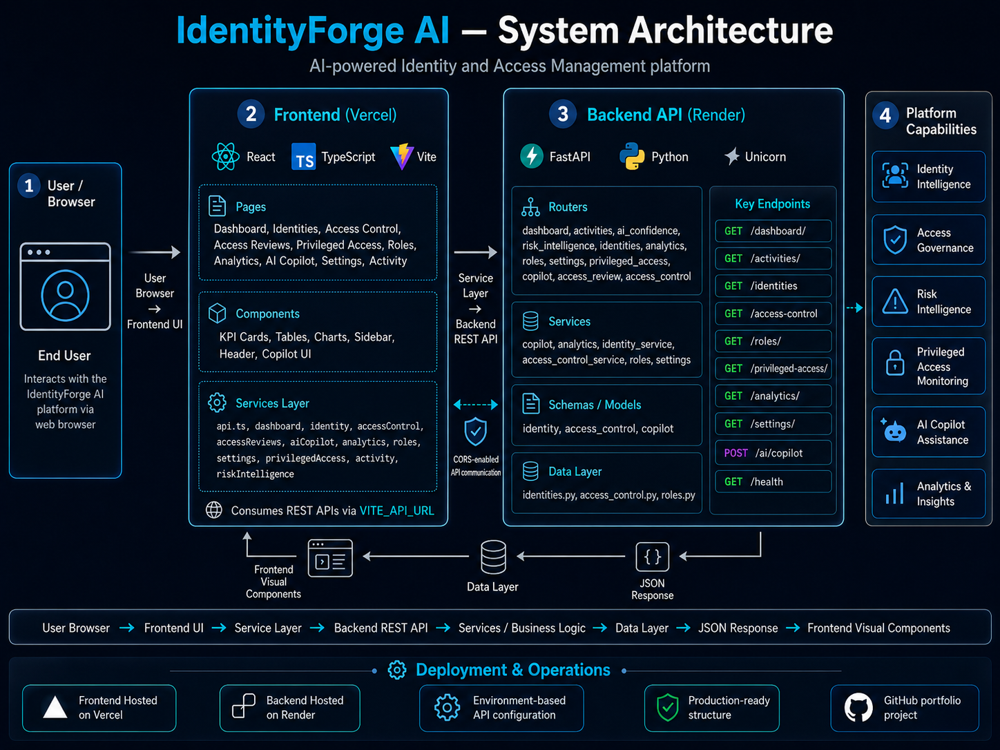
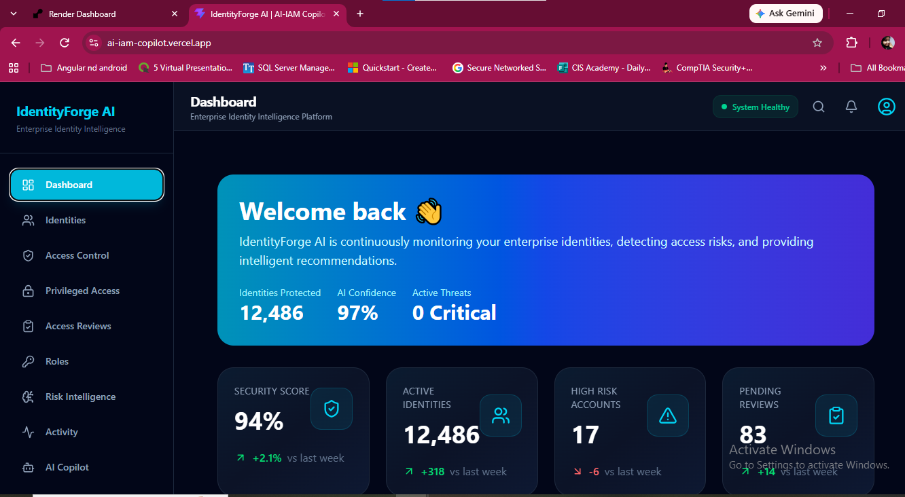
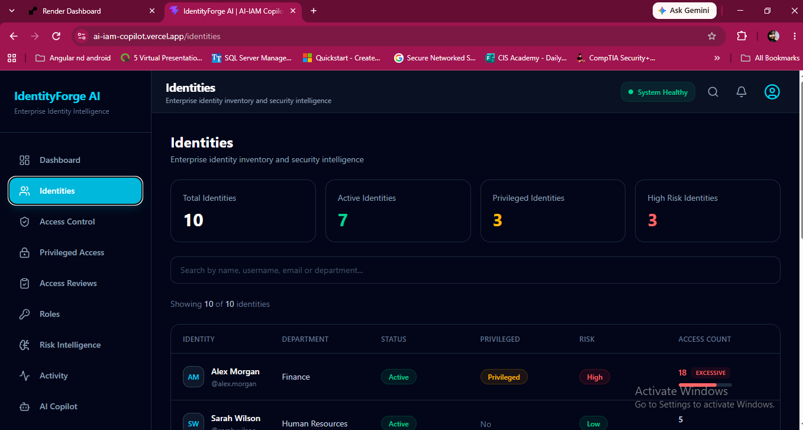
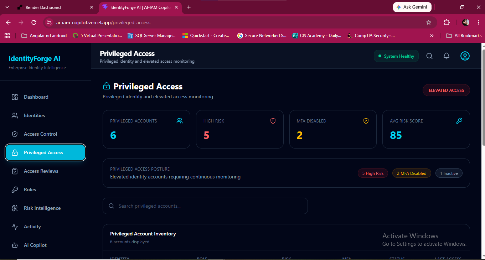
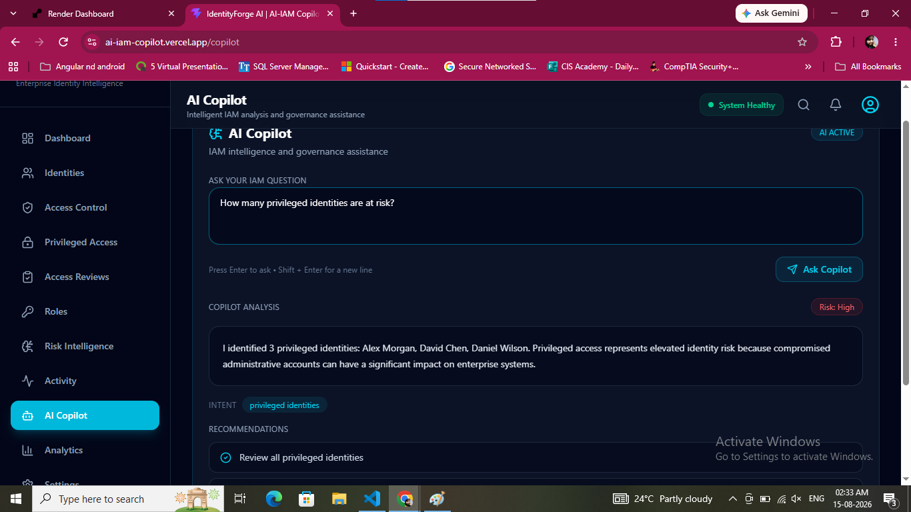

# IdentityForge AI

> **AI-Powered Identity & Access Management Security Platform**

IdentityForge AI is a production-ready IAM security platform that brings together identity visibility, access governance, privileged access monitoring, risk intelligence, analytics, and an AI-powered IAM Copilot in a single web application.

## Live Application

- **Frontend:** https://ai-iam-copilot.vercel.app
- **Backend API:** https://ai-iam-copilot-api.onrender.com
- **API Documentation:** https://ai-iam-copilot-api.onrender.com/docs

---

## Overview

IdentityForge AI was built as a hands-on Identity and Access Management portfolio project focused on practical IAM security workflows.

The platform demonstrates how identity, access, governance, privileged-account, risk, and analytics data can be presented through a modern security dashboard and exposed through REST APIs for an AI-assisted IAM experience.

The project combines:

- Identity lifecycle visibility
- Access governance
- Privileged access monitoring
- Role and permission analysis
- Identity risk intelligence
- Access reviews
- Security activity monitoring
- IAM analytics
- AI-assisted IAM investigation

---

## Why IdentityForge AI?

Modern IAM teams need more than user provisioning. They need visibility into:

- Who has access
- Which identities are privileged
- Which accounts present the highest risk
- Where excessive access exists
- Which access reviews require attention
- Which identities or roles should be investigated first

IdentityForge AI demonstrates these concepts in a unified, recruiter-friendly security platform.

---

## Architecture



### Production Architecture

```text
User / Browser
      │
      ▼
Vercel
React + TypeScript + Vite
      │
      │ HTTPS / VITE_API_URL
      ▼
Render
FastAPI + Python + Uvicorn
      │
      ├── Identity Intelligence
      ├── Access Control
      ├── Access Reviews
      ├── Privileged Access
      ├── Roles
      ├── Risk Intelligence
      ├── Activity
      ├── Analytics
      ├── Settings
      └── AI Copilot
```

The frontend uses environment-based API configuration through `VITE_API_URL`, while the backend exposes FastAPI REST endpoints and uses CORS configuration for approved frontend origins.

---

## Product Screenshots

### Dashboard



The dashboard provides a consolidated view of identity, governance, risk, activity, and security metrics.

### Identities



The identities module provides visibility into users, status, privilege level, access count, department, and identity risk.

### Privileged Access



The privileged access module highlights sensitive accounts and helps identify high-risk privileged identities requiring investigation.

### AI Copilot



The AI Copilot accepts IAM-focused security questions and returns contextual responses based on the platform's identity and access data.

---

## Core Capabilities

### Identity Intelligence

- Identity inventory
- User status visibility
- Department-level context
- Privileged identity identification
- Access-count visibility
- Risk-level classification

### Access Control

- Access-control inventory
- Privileged access filtering
- High-risk access identification
- Excessive access detection
- Least-privilege focused visibility

### Access Reviews

- Governance review visibility
- Review status tracking
- Risk-based review prioritization
- Audit-readiness support

### Privileged Access

- Privileged identity monitoring
- Risk scoring
- MFA visibility
- Account status tracking
- Investigation prioritization

### Roles

- Role inventory
- Permission visibility
- Risk-focused role analysis
- Role governance support

### Risk Intelligence

- Identity risk visibility
- Risk prioritization
- High-risk identity identification
- IAM security insights

### Activity

- Security and identity activity visibility
- Operational monitoring
- IAM event presentation

### Analytics

- Identity and access metrics
- Governance insights
- Security trend visibility
- Dashboard-driven analysis

### AI Copilot

The AI Copilot provides an IAM-focused conversational interface for investigating identity and access data.

Example questions include:

```text
Which privileged identities are currently the highest risk?
```

```text
Which privileged accounts have MFA disabled?
```

```text
Which identities have excessive access?
```

```text
Which access reviews require immediate attention?
```

```text
Identify the top identity security risks in the current environment.
```

---

## Technology Stack

### Frontend

- React
- TypeScript
- Vite
- REST API integration
- Environment-based API configuration
- Responsive security dashboard UI

### Backend

- Python
- FastAPI
- Uvicorn
- Pydantic
- REST API architecture
- CORS middleware
- Service-oriented backend structure

### Deployment

- **Frontend:** Vercel
- **Backend:** Render
- **Source Control:** GitHub
- **Environment Configuration:** Vercel and Render environment variables

---

## Project Structure

```text
AI-IAM-Copilot/
│
├── backend/
│   ├── app/
│   │   ├── api/
│   │   ├── data/
│   │   ├── models/
│   │   ├── routers/
│   │   ├── schemas/
│   │   ├── services/
│   │   └── main.py
│   │
│   └── requirements.txt
│
├── frontend/
│   ├── src/
│   │   ├── components/
│   │   ├── hooks/
│   │   ├── pages/
│   │   ├── services/
│   │   ├── types/
│   │   └── App.tsx
│   │
│   ├── .env.production.example
│   └── package.json
│
├── screenshots/
│   ├── Architecture.png
│   ├── dashboard.png
│   ├── identities.png
│   ├── privileged-access.png
│   └── ai-copilot.png
│
├── docs/
├── infrastructure/
├── scripts/
├── tests/
├── CHANGELOG.md
└── README.md
```

---

## Key API Endpoints

Examples of available backend endpoints include:

```text
GET  /health
GET  /dashboard/
GET  /activities/
GET  /identities
GET  /access-control
GET  /access-control/privileged
GET  /access-control/high-risk
GET  /access-control/excessive
GET  /roles/
GET  /privileged-access/
GET  /analytics/
GET  /settings/
POST /ai/copilot
```

Interactive API documentation is available through FastAPI Swagger UI:

```text
https://ai-iam-copilot-api.onrender.com/docs
```

---

## Local Development

### Backend

From the project root:

```powershell
cd backend
.\.venv\Scripts\Activate.ps1
uvicorn app.main:app --host 0.0.0.0 --port 8000
```

The backend will be available at:

```text
http://localhost:8000
```

### Frontend

Open another terminal:

```powershell
cd frontend
npm install
npm run dev
```

The frontend will typically be available at:

```text
http://localhost:5173
```

---

## Environment Configuration

### Frontend

Local development can use:

```text
VITE_API_URL=http://localhost:8000
```

Production uses the Vercel environment variable:

```text
VITE_API_URL=https://ai-iam-copilot-api.onrender.com
```

The repository contains only a safe example file:

```text
frontend/.env.production.example
```

### Backend

The backend uses environment-based CORS configuration:

```text
BACKEND_CORS_ORIGINS=https://ai-iam-copilot.vercel.app
```

Sensitive environment files are excluded from Git through `.gitignore`.

---

## Production Security & Repository Hygiene

The production repository has been checked for accidental secret exposure using:

- Tracked sensitive-file review
- `.env` verification
- Source-code secret-pattern scanning
- Git-history sensitive-file review
- `.gitignore` validation
- Gitleaks Git-history scanning

No secret leaks were detected during the final repository security checkpoint.

---

## IAM & Security Concepts Demonstrated

IdentityForge AI demonstrates practical concepts relevant to IAM and cybersecurity roles, including:

- Identity governance
- Least privilege
- Privileged access management
- Role-based access control concepts
- Access reviews
- Access-risk identification
- Identity-risk prioritization
- MFA visibility
- Excessive-access detection
- Audit readiness
- Security analytics
- IAM investigation workflows
- Secure environment configuration
- REST API security integration

---

## Production Status

```text
Frontend Deployment        LIVE
Backend Deployment         LIVE
Dashboard                  Operational
Identities                 Operational
Access Control             Operational
Privileged Access          Operational
Access Reviews             Operational
Roles                      Operational
Risk Intelligence          Operational
Activity                   Operational
Analytics                  Operational
AI Copilot                 Operational
Settings                   Operational
```

---

## Future Enhancements

Potential future extensions include:

- Microsoft Entra ID integration
- SailPoint integration
- Okta integration
- SCIM-based provisioning
- Authentication and authorization
- Persistent database integration
- Policy-based access decisions
- Automated remediation workflows
- Advanced access-certification workflows
- SIEM integration
- Identity threat detection
- Cloud-native deployment improvements
- Automated testing and CI/CD enhancements

---

## Portfolio Value

IdentityForge AI demonstrates the ability to combine IAM security concepts with practical software engineering and production deployment.

The project highlights experience across:

- Identity and Access Management
- Identity governance
- Privileged access security
- Access-risk analysis
- REST APIs
- Python / FastAPI
- React / TypeScript
- Production troubleshooting
- Secure configuration
- Cloud deployment
- AI-assisted IAM workflows

---

## Author

**Suvarna**

Cybersecurity | Identity & Access Management | IAM Security | Python | FastAPI | React | TypeScript

GitHub: https://github.com/suvarna-art
